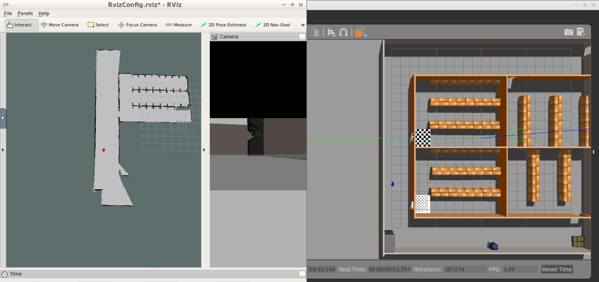
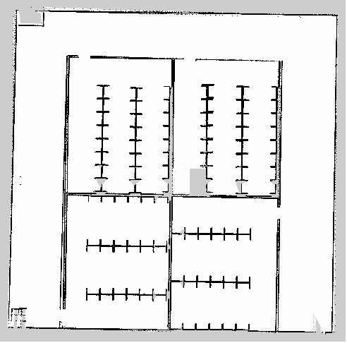

# RoboND-HomeServiceRobot

---

### Video Demo


### Dependencies

- ROS Kinetic
- CMake 2.8

### Installing ROS dependencies

```bash
$ cd <repo root>/catkin_ws
$ sudo apt update
$ rosdep install --from-paths ./src --ignore-packages-from-source -y
```

### Compiling the program

```bash
$ cd <repo root>/catkin_ws
$ catkin_make
```

### Run SLAM mapping

To run the mapping:

```bash
$ cd <repo root>/catkin_ws/src/scripts
$ sh mapping.sh
```

Use the `teleop_twist_keyboard` x-terminal to navigate the robot within the simulation world.



After mapping the entire simulation world, execute the following command to generate the map file.

```
$ rosrun map_server map_saver -f myMap
```



Along with the `myMap.pgm` file, a config file `myMap.yaml` will also be generated.

``` {.line-numbers}
image: myMap.pgm
resolution: 0.050000
origin: [-13.249369, -12.171536, 0.000000]
negate: 0
occupied_thresh: 0.65
free_thresh: 0.196
```

### Run home service task

The home service task contains the following behaviors

1. Green cube marker shows up at pickup location on gazebo world launch
2. Robot moves to pickup location
3. Green cube marker disappear upon robot arrival
4. Robot waits for 5 seconds after picking up the payload
5. Robot then moves to the drop off location, i.e. robot's initial position
6. Green cube marker reappear on drop off location upon robot arrival

The ROS packages responsible for these behaviors are as follows:

- <a href=http://wiki.ros.org/amcl>amcl</a> package, i.e. Adaptive Monte Carlo Localization, responsible for localization based on laser scan input.
- <a href=http://wiki.ros.org/move_base>move_base</a> package, ROS navigation stack responsible for creating a path for the robot based on Dijkstra's algorithm, while avoiding obtacles on its path.
- <a href='./catkin_ws/src/add_markers'>add_markers</a> package, a custom package in this repo, responsible for displaying the payload, i.e. the green cube marker, within the RVIZ visualization.
- <a href='./catkin_ws/src/pick_objects'>pick_objects</a> package, a custom package in this repo, responsible for sending `move_base_msg::MoveBaseGoal` message to coordinate the payload pickup and drop off activities.

To run the home service demo:

```bash
$ cd <repo root>/catkin_ws/src/scripts
$ sh home_service.sh
```